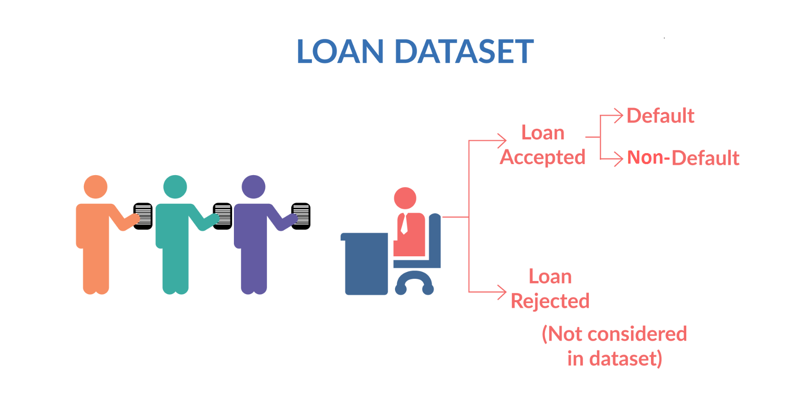

# Data Science Portfolio

---

## Machine learning

### Lending Club Case Study

Lending Club case study explores how a peer-to-peer lending platform can leverage data analysis to predict loan defaults. By analyzing borrower data, the study aims to minimize loan risk for lenders and maximize return on investment. This can be achieved by identifying factors that indicate a borrower's likelihood to repay.

---
